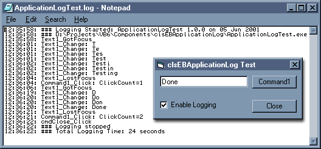



## clsEBApplicationLog

### Description

An easy to use application logging class. Writes custom messages to a log file - useful for debugging problems on remote machines.
 
### More Info
 

             |
---                |---
**Submitted On**   |2001-06-05 12:43:00
**By**             |[Richard@Home](https://github.com/Planet-Source-Code/PSCIndex/blob/master/ByAuthor/richard-home.md)
**Level**          |Intermediate
**User Rating**    |4.5 (18 globes from 4 users)
**Compatibility**  |VB 6\.0
**Category**       |[Debugging and Error Handling](https://github.com/Planet-Source-Code/PSCIndex/blob/master/ByCategory/debugging-and-error-handling__1-26.md)
**World**          |[Visual Basic](https://github.com/Planet-Source-Code/PSCIndex/blob/master/ByWorld/visual-basic.md)
**Archive File**   |[clsEBAppli20617652001\.zip](https://github.com/Planet-Source-Code/richard-home-clsebapplicationlog__1-23791/archive/master.zip)

